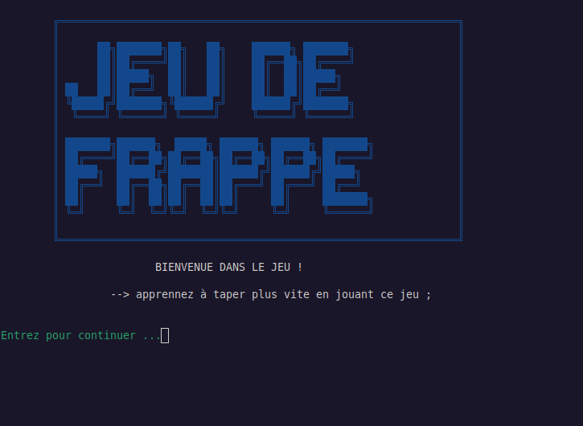

# Création de Jeu de Frappe
---

---
## Description détaillée

**Création de Jeu de Frappe** est un jeu en ligne de commande écrit en **Bash** 
qui teste et améliore votre vitesse de frappe. Le programme génère aléatoirement des mots, 
des chiffres ou un mélange des deux, et vous devez les recopier avant la fin du temps donné selon le niveau choisi.
Trois niveaux de difficulté modulent le délai de saisie, et trois modes de jeu permettent de travailler 
des ensembles de caractères différents. Idéal pour s’entraîner au clavier tout en s’amusant dans son terminal.

## Fonctionnalités principales

- **Trois niveaux de difficulté** : Facile (15s) , Normal (10s) , Difficile (5s)
- **Trois modes de jeu** :
  - *Lettres* – mots tirés d’un dictionnaire (`exemple.lettre`)
  - *Chiffres* – nombres aléatoires de 1 à 32767
  - *Mélange* – alternance aléatoire entre lettres et chiffres
- Session de 10 frappes avec calcul de la précision finale
- Interface colorée avec retours visuels (rouge/vert/bleu) et effet clignotant
- Proposition de rejouer à la fin d’une partie
---
## Prérequis et Installation

### Prérequis

- Système d’exploitation : Linux , macOS ou WSL (Windows Subsystem for Linux)
- Bash version 5.0 ou ultérieure
- Commandes standard : `cat`, `tr`, `awk`, `read` (toutes présentes par défaut)

### Installation

1. **Cloner le dépôt** (ou télécharger manuellement les fichiers)
	```bash
	git clone https://github.com/ValisoaNr/Creation-Jeu-de-frappe.git
	cd Creation-Jeu-de-frappe

2. **Verification** , verifie bien que les fichiers suivantes sont dedans :
	* exemple.lettre
	* jeuDEfrappe.ascii	
	* jeuDEfrappe.sh

3. **Rend `jeuDEfrappe.sh` executable**
	```bash
	chmod +x jeuDEfrappe.sh

4. **Lance le avec** : ./jeuDEfrappe.sh
